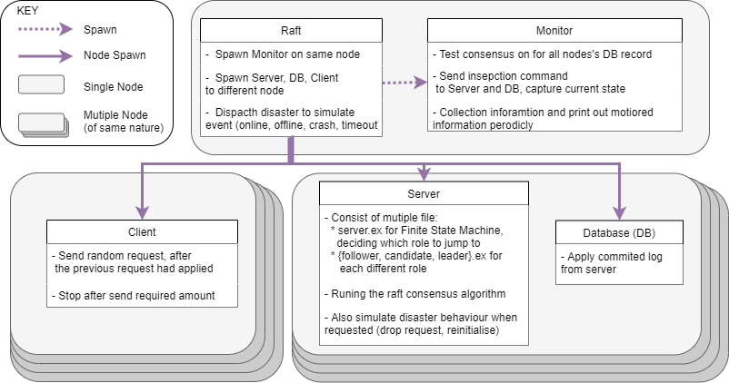
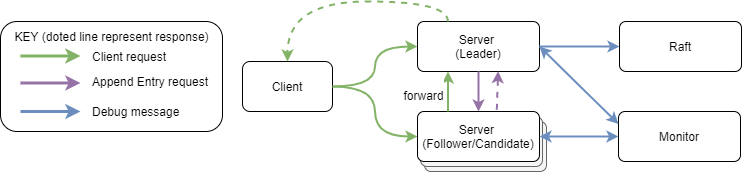
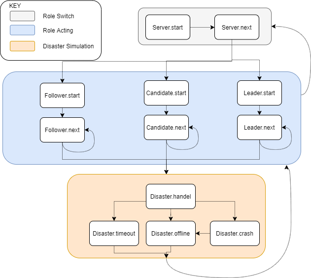

Raft
======

Component Structure
-------------------

### Instance Initiation and Flow of Message

Figure above provides an info-graphic summary of what
happens when our raft implementation and its test components start.

In Figure above, the green
arrow shows a typical client request, Clients send their requests to any
of the server, if the server is a follower, it will forward the
request to the leader. Only the leader can respond to client when the
request had been committed (by the majority). Client will then remember
the Leader's address, and send subsequent requests directly to the
leader. The blue arrow shows the debugging interface, Servers report
updates to Monitor, and the Monitor can request server to print out all
of its log. Leader also informs Raft when it becomes leader, allowing
Disaster to act directly the leader, crash the leader for example.

### Server Life-Cycle

Our implementation splits the Server Elixir Process to three stages.
Each of top stage gives control to the lower stage, and waits for the
lower stage to finish. The first stage is Role Switch, where servers
check their roles and run their Follower, Candidate, Leader.start. When
these roles exit, they clear the Elixir mailbox, only leaving behind
what is important for the next role. The second stage is Role Acting,
where the Server executes the raft algorithm, when the Raft process
mentioned in [previous sub section](#Instance Initiation and Flow of Message)
dispatches a disaster it will enter the third stage. In the third stage,
Disaster Simulation, the Server will drop all
the incoming message, until it exit this stage. The difference between
different disasters are defined in section [1.2.4](#disasters).

Implementation choices
----------------------

### Server structure

As mentioned earlier, the server's control is split to three stage, the
top stage give control to lower stage by running lower stage's function
and wait for it to finish . When the system is running normally,
execution is mainly at the second Role Acting stage. Events such as role
or term changes cause these modules to exit, and the server module
decides which role to switch to next.

In these modules, initialization is done in the start function, with
everything else done by the next function. As our implementation uses
message passing for communication, timeouts are implemented through
messages and the send\_after function. The check\_term\_and function
does term guarding, with the rest of the message handling only being
executed if this term check has passed.

When servers switch between these states, the role's message queue is
flushed with exception of the Will message, which is kept and sent to
its self before transiting to the next state.

### State

####

The State module stores the server state, and is common between the
leader, follower and candidate states. Servers are able to read and
modify this state regardless of which of the three states they are in.

All servers in the network keeps a list of server ids for all servers in
network including itself, where the id for a server is its index in this
list. The ids thus range from 0 to the size of the network-1.

### Logs

####

The logs are stored in State, and raft ensures it will be consistent
across servers. It is a linked list, and every log is a form of tuple
payload, term when leader receives message. The payload is a dictionary
consist of Client Address, Command and UID. When the leader commit a
log, the response is send to the Client Address with the UID, the
command is executed by the database.

### Disasters

As described in the previous section, the disaster module handles
various changes to the system.

1.  Offline refers to a server becoming unavailable, where no state is
    lost. It is analogous to a loss in network connectivity, where the
    server would still be functioning.

2.  Crash refers to a server both becoming unavailable, and losing any
    current state. It is analogous to a server restarting or a complete
    loss of a server.

3.  Timeout refers to a server hitting the election timeout, switch to
    candidate and starting a new election.

4.  Online refers to a server becoming available again. It can happen
    from both the crashed or offline states.

### Server crashes

####

In order to recover a crashed/wiped server, we have to known the current
last\_applied state, or start from scratch. To keep our implementation
simple, we have chosen the latter scenario, as we do not need to
implement the persistent state. This keeps it similar to the real world
scenario where a server crashes and the data has not been written to
persistent storage. Network configuration is assumed to be relatively
static, and saved on persistent storage, allowing the recovered server
to rejoin the system. The server then has to collect all logs from the
beginning and apply them.

### Client Communication

####

In the event that a server is not yet aware of the leader, client
requests are simply ignored, and it is up to the client to retry these
requests at a later time. This situation could happen if servers have
just joined the network, or in the event of a network partition where
some servers cannot communicate with the leader,

All client requests have a unique id(UID) which is used to sort the log.
When requests are received, this UID is checked against the logs to see
if it is a duplicate, sending a reply back if it exists and is
committed, and ignoring it otherwise. New requests are appended to the
log. This process can be optimized through various methods, such as log
compaction, compression or UID indexing. These were not done to reduce
implementation complexity.

As the message passing between clients and servers are asynchronous, our
implementation does not allow clients to recall messages. Also, in the
event of the client address changing, the reply will not be successfully
sent to the client. It is up to the client to wait for the reply
timeout, and resend the request from its new address.

### Code Structure

####

To make the code more readable, and avoid reinventing the wheel, the
code are organised by functionality, not which instance they belong to.
In particular, state.ex act as a library for different state operations,
which is invoked heavily by follower, candidate.ex, monitor.ex contains
all the debug printing code, invoked by almost every other file.

Testing
=======

Test and Debugging Methodology
------------------------------

####

While developing the Server, we used unit test and iex to test basic
functionalities, the debugging messages are placed with varies level. We
also placed warning on the routine where server should not go, and halt
once the first serious fault is suspected. The monitor.ex is used as a
centralised location for all debug functions, allow easy printing with a
single function call.

The system was implemented with an emphasis on ease of testing.
Configuration can be fed to test, overriding the default parameters set
in the dac module. A list of sample configuration are stored under the
testplan folder, the README.md file also contains detailed instruction
of how to write test-case. We created a test script script/test.sh to
run test cases and save outputs to a log file, allowing for easy
extensions without modifying source code. This also improved test
repeatability, reducing the chance of regression bugs.

Test Findings
-------------

### Normal Operation

####

In this test, the system was ran normally, and the state was checked
after several iterations, with no failures being simulated. The output
can be seen in output/1\_c2s5\_normal\_ape.log. Here, a leader is
successfully elected, the entire test consists of a single term, with
all servers successfully committing all 20 client requests by the end of
the test.

### Single Failure

#### Follower Node

This test case shows what happens when a single follower crashes, and
then recovers a while later. The system should continue operating
normally with one less node, and should be able to update its entries
from the leader node once it has recovered. The output can be seen in
output/2\_c2s5\_single\_failure\_follower\_ape.log.\
The testing sequence is as follows:\
time = 0ms, Node 0 timeout to force election and be elected leader\
time = 1000ms, Node 1 crashes\
time = 2000ms, Node 1 recovers

From this test, we see that the system continues to operate with the
leader node and the 3 remaining follower nodes. When the crashed node
recovers, the system continues to operate, and the crashed node
recognizes the current leader, and rejoins as a follower. At the end of
the log we also see that the crashed node is able to

#### Leader Node

This test case shows what happens when the leader node crashes, and then
recovers a while later. The leader crashing should force other servers
to eventually timeout and elect a new leader, after which normal system
operation should continue. The crashed node should then be able to
rejoin as a follower, and update its log from the leader node once it
has recovered. The output can be seen in
output/3\_c2s5\_single\_failure\_leader\_ape.log.\
The testing sequence is as follows:\
time = 1000ms, Current leader node crashes\
time = 2000ms, Crashed node recovers

In one test run, we saw that when the current leader(server 4) crashes,
server 3 was the first to timeout, becoming a candidate, and gets
successfully elected as a leader, allowing system operation to continue.

### Multiple Failures

#### Leader Failures

In this case, 2 server nodes are set to fail, with the current leader
failing each time. The system should be able to replace the leader in
both situations, and continue operating without them. The output can be
seen in output/4\_c2s5\_two\_failures.log.\
The testing sequence is as follows:\
time = 0ms, Node 0 timeout to force election and be elected leader\
time = 1000ms, Current leader node goes offline\
time = 1500ms, Current leader node crashes From the log, we see that the
system is successful in replacing both failed leaders, and continuing
operation with 3 nodes.

#### Majority Failures

In this case, 3 nodes fail in total, with the current leader node
failing each time, followed by a failed node recovering. The system
should continue to function till the third server fails, at which point
it should be unable to elect a new leader. The recovery of one of the
failed servers should allow the system to resume operation. The output
can be seen in output/5\_c2s5\_voting\_with\_majority\_crash.log.\
The testing sequence is as follows:\
time = 0ms, Node 0 timeout to force election and be elected leader\
time = 1000ms, Current leader node goes offline\
time = 1500ms, Current leader node crashes\
time = 2000ms, Current leader node goes offline\
time = 2500ms, Crashed node(crashed at t=1500ms) recovers

#### Network Partition

In this case, a network partition is simulated, by taking nodes offline
and online in groups of 2 and 3. This lets us simulate each of the
partitions. The system performed as expected, continuing to run in the
partition with 3 nodes, and being unable to elect a leader in the
partition with 2 nodes. When the network partition was removed, the
system was able to continue operating, with one of the nodes from the
larger partition becoming the leader. The output can be seen in
output/8\_c2s5\_partition.log.\
The testing sequence is as follows:\
time = 100ms, Node 0,1 goes offline\
time = 2000ms, Node 2,3,4 goes offline\
time = 4000ms, Node 0,1 goes online\
time = 6000ms, Node 2,3,4 goes online

### Timeouts

####

The raft paper states that the system should remain functional as long
as the following relationship is maintained, with at least an order of
magnitude between each part.

    broadcastTime << electionTimeout << Mean Time Between Failure(MTBF)

Our testing focuses on the second part of the relationship by adjusting
the MTBF.

#### Low MTBF

The electionTimeout is set to be between 150-300ms as specified by the
raft specification, and a server is set to fail every 250ms, with the
previously failed server recovering, resulting in a MTBF for a single
server of 1000ms.\
Despite this, the system continues functioning and responding to client
requests. One thing to note is that as the servers are failing at fixed
intervals, it does not accurately simulate a real world scenario where
failures can happen at any time, even though they share the same Poisson
distribution.

#### Very Low MTBF

To further test the above case to an extreme, the MTBF is further
reduced to 300ms, identical to the max electionTimeout. In this case, we
see that the system performs as expected by the raft specification,
having very little progress while nodes are failing, as so much time is
spent conducting the election that the next leader is likely to fail
before progress can be made.

### Load Test

In this test, we ran the system with 10 clients and 5 servers, to
simulate a much higher client request load. No failures were simulated.
The output can be seen in output/11\_c10s5\_normal\_ape\_load\_test.log.
The system is able to continue functioning despite the high load.

Conclusion
==========

####

Overall, we see that our implementation of raft, while not being very
feature rich, is able to perform as expected, tolerating minority
failures well, and failing as expected when the test forces it.
